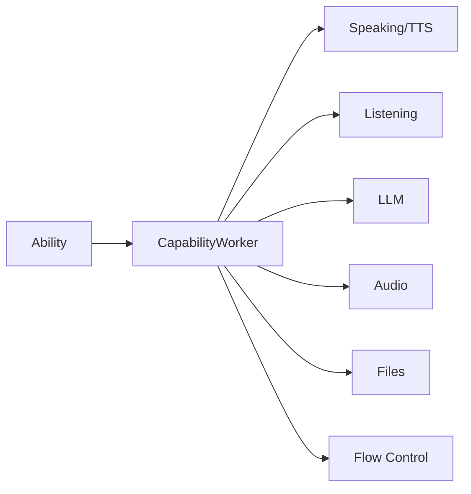

## Overview

The `CapabilityWorker` is the **primary SDK interface** for building OpenHome Abilities. It provides all I/O operations including text-to-speech, user input, LLM calls, audio playback, file storage, and flow control.

<Note>
Access `CapabilityWorker` via `self.capability_worker` after initializing it in your Ability's `call()` method.
</Note>

## Initialization

Initialize `CapabilityWorker` in your Ability's `call()` method:

```python
from src.agent.capability import MatchingCapability
from src.main import AgentWorker
from src.agent.capability_worker import CapabilityWorker

class MyAbility(MatchingCapability):
    worker: AgentWorker = None
    capability_worker: CapabilityWorker = None

    def call(self, worker: AgentWorker):
        self.worker = worker
        self.capability_worker = CapabilityWorker(self)
        self.worker.session_tasks.create(self.run())

    async def run(self):
        await self.capability_worker.speak("Hello!")
        self.capability_worker.resume_normal_flow()
```

## Architecture



`CapabilityWorker` acts as the bridge between your Ability code and the OpenHome Agent runtime. It handles:

- **Communication**: WebSocket connections to the frontend
- **Audio**: TTS generation, audio playback, and streaming
- **User Input**: Speech-to-text transcription
- **LLM**: Text generation with conversation history
- **Storage**: Server-side file persistence
- **Control Flow**: Signaling when your Ability is done

## Quick Reference

### Speaking & Text-to-Speech

| Method | Description | Async |
|--------|-------------|-------|
| [`speak(text)`](/api/speaking#speak) | Convert text to speech using Agent's voice | ✓ |
| [`text_to_speech(text, voice_id)`](/api/speaking#text-to-speech) | Convert text to speech with custom voice | ✓ |

### Listening & User Input

| Method | Description | Async |
|--------|-------------|-------|
| [`user_response()`](/api/listening#user-response) | Wait for user's next input | ✓ |
| [`wait_for_complete_transcription()`](/api/listening#wait-for-complete-transcription) | Wait for complete utterance | ✓ |
| [`run_io_loop(text)`](/api/listening#run-io-loop) | Speak + listen combined | ✓ |
| [`run_confirmation_loop(text)`](/api/listening#run-confirmation-loop) | Yes/no confirmation loop | ✓ |

### LLM & Text Generation

| Method | Description | Async |
|--------|-------------|-------|
| [`text_to_text_response(prompt, history, system_prompt)`](/api/llm#text-to-text-response) | Generate text with LLM | ✗ |

<Warning>
`text_to_text_response()` is the **only synchronous method** in CapabilityWorker. Do NOT use `await`.
</Warning>

### Audio Playback

| Method | Description | Async |
|--------|-------------|-------|
| [`play_audio(file_content)`](/api/audio#play-audio) | Play audio from bytes | ✓ |
| [`play_from_audio_file(file_name)`](/api/audio#play-from-audio-file) | Play local audio file | ✓ |
| [`stream_init()`](/api/audio#audio-streaming) | Initialize audio streaming | ✓ |
| [`send_audio_data_in_stream(data, chunk_size)`](/api/audio#audio-streaming) | Send audio chunks | ✓ |
| [`stream_end()`](/api/audio#audio-streaming) | End audio streaming | ✓ |

### File Storage

| Method | Description | Async |
|--------|-------------|-------|
| [`check_if_file_exists(filename, temp)`](/api/files#check-if-file-exists) | Check file existence | ✓ |
| [`write_file(filename, content, temp)`](/api/files#write-file) | Write/append to file | ✓ |
| [`read_file(filename, temp)`](/api/files#read-file) | Read file contents | ✓ |
| [`delete_file(filename, temp)`](/api/files#delete-file) | Delete file | ✓ |

### Flow Control

| Method | Description | Async |
|--------|-------------|-------|
| [`resume_normal_flow()`](/api/flow-control#resume-normal-flow) | **REQUIRED** - Return control to Agent | ✗ |
| [`send_interrupt_signal()`](/api/flow-control#send-interrupt-signal) | Stop output, return to input | ✓ |
| [`exec_local_command(command)`](/api/flow-control#exec-local-command) | Execute command on local device | ✓ |
| [`send_email(...)`](/api/flow-control#send-email) | Send email via SMTP | ✗ |

### User Context

| Method | Description | Async |
|--------|-------------|-------|
| `get_timezone()` | Get user's timezone string | ✗ |
| `get_full_message_history()` | Get conversation history | ✗ |

### WebSocket

| Method | Description | Async |
|--------|-------------|-------|
| `send_data_over_websocket(type, data)` | Send custom events | ✓ |
| `send_devkit_action(action)` | Send hardware actions | ✓ |

### Audio Recording

| Method | Description | Async |
|--------|-------------|-------|
| `start_audio_recording()` | Start recording | ✗ |
| `stop_audio_recording()` | Stop recording | ✗ |
| `get_audio_recording()` | Get WAV data | ✗ |
| `get_audio_recording_length()` | Get recording duration | ✗ |

## Complete Example

```python main.py
import json
from src.agent.capability import MatchingCapability
from src.main import AgentWorker
from src.agent.capability_worker import CapabilityWorker

class WeatherAbility(MatchingCapability):
    worker: AgentWorker = None
    capability_worker: CapabilityWorker = None

    def call(self, worker: AgentWorker):
        self.worker = worker
        self.capability_worker = CapabilityWorker(self)
        self.worker.session_tasks.create(self.run())

    async def run(self):
        try:
            # Ask for location
            location = await self.capability_worker.run_io_loop(
                "What city would you like weather for?"
            )

            # Log the request
            self.worker.editor_logging_handler.info(f"Weather requested for: {location}")

            # Get weather (using LLM for demo - use real API in production)
            prompt = f"What's the weather like in {location}? Respond in one sentence."
            response = self.capability_worker.text_to_text_response(prompt)

            # Speak the result
            await self.capability_worker.speak(response)

        except Exception as e:
            self.worker.editor_logging_handler.error(f"Error: {e}")
            await self.capability_worker.speak("Sorry, something went wrong.")

        # ALWAYS resume normal flow
        self.capability_worker.resume_normal_flow()
```

## Next Steps

<CardGroup cols={2}>
  <Card title="Speaking" icon="volume" href="/api/speaking">
    Text-to-speech with default or custom voices
  </Card>
  <Card title="Listening" icon="microphone" href="/api/listening">
    User input and combined I/O loops
  </Card>
  <Card title="LLM" icon="brain" href="/api/llm">
    Text generation with conversation history
  </Card>
  <Card title="Flow Control" icon="traffic-light" href="/api/flow-control">
    Critical control flow methods
  </Card>
</CardGroup>

## Related

- [AgentWorker Reference](/api/flow-control#agentworker-reference) - Logging and session management
- [Basic Template](https://github.com/openhome-dev/abilities/blob/main/templates/basic-template/main.py) - Simple example
- [Loop Template](https://github.com/openhome-dev/abilities/blob/main/templates/loop-template/main.py) - Multi-turn conversation