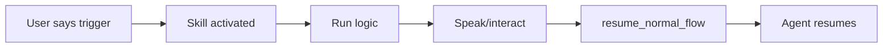
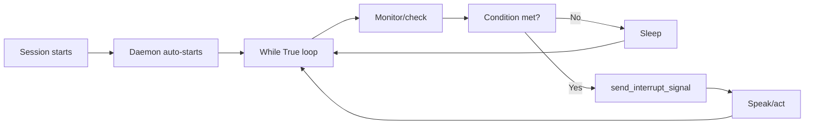

## Overview

Every OpenHome Ability falls into one of three categories, each with distinct triggers, lifecycles, and use cases.

<CardGroup cols={3}>
  <Card title="Skills" icon="wand-magic-sparkles">
    Triggered by user or brain routing. Runs once and exits.
  </Card>
  <Card title="Background Daemons" icon="clock">
    Runs automatically on session start. Loops continuously.
  </Card>
  <Card title="Local" icon="server">
    Runs on-device hardware. Bypasses cloud sandbox.
  </Card>
</CardGroup>

---

## Skills

**Skills** are the workhorse of OpenHome Abilities. A user says a hotword (or the brain's routing LLM invokes it), the ability runs, does its thing, and hands control back via `resume_normal_flow()`.

### When to Use Skills

- User-initiated actions ("play music", "check weather")
- API integrations (search web, fetch data)
- Interactive conversations (quizzes, advice)
- One-time tasks (send email, set alarm)

### Lifecycle



### Entry File

**`main.py`** — Contains your main logic

### Example: Basic Advisor Skill

```python main.py
import json
from src.agent.capability import MatchingCapability
from src.main import AgentWorker
from src.agent.capability_worker import CapabilityWorker

class BasicTemplateCapability(MatchingCapability):
    worker: AgentWorker = None
    capability_worker: CapabilityWorker = None

    #{{register capability}}

    async def run(self):
        # Greet and ask for input
        await self.capability_worker.speak("Hi! How can I help you today?")
        user_input = await self.capability_worker.user_response()
        
        # Generate response with LLM
        response = self.capability_worker.text_to_text_response(
            f"Give a short, helpful response to: {user_input}"
        )
        
        # Speak result
        await self.capability_worker.speak(response)
        
        # Exit cleanly
        self.capability_worker.resume_normal_flow()

    def call(self, worker: AgentWorker):
        self.worker = worker
        self.capability_worker = CapabilityWorker(self)
        self.worker.session_tasks.create(self.run())
```

<Info>
**Key Pattern**: Skills always end with `resume_normal_flow()` to return control to the Agent.
</Info>

### Common Skill Patterns

| Pattern | Description | Example |
|---------|-------------|--------|
| **Fire-and-forget** | Trigger → Execute → Exit | Send email, play sound |
| **API Call** | Fetch data → Speak result → Exit | Weather, web search |
| **Interactive** | Loop with listen → respond → exit command | Quiz game, advisor |
| **LLM Translator** | Voice → LLM → Command → Execute | Terminal control, smart home |

---

## Background Daemons

**Background Daemons** start automatically when a user connects and run in a `while True` loop for the entire session. No hotword needed. They can monitor conversations, poll APIs, watch for time-based events, and interrupt the main flow when something fires.

### When to Use Background Daemons

- Time-based triggers (alarms, reminders, Pomodoro timer)
- Continuous monitoring (conversation logger, baby monitor)
- Periodic checks (stock prices, news feed)
- Ambient intelligence (context accumulation, user profiling)

### Lifecycle



### Entry File

**`watcher.py`** — Contains the daemon loop

<Note>
Daemons can be **standalone** (`watcher.py` only) or **combined** with a Skill (`main.py` + `watcher.py`).
</Note>

### Example: Standalone Watcher Daemon

```python watcher.py
import json
from src.agent.capability import MatchingCapability
from src.main import AgentWorker
from src.agent.capability_worker import CapabilityWorker
from time import time

class WatcherCapabilityWatcher(MatchingCapability):
    worker: AgentWorker = None
    capability_worker: CapabilityWorker = None
    background_daemon_mode: bool = False
    
    #{{register capability}}

    async def first_function(self):
        self.worker.editor_logging_handler.info(f"{time()}: Watcher Called")
        
        while True:
            # Monitor conversation history
            message_history = self.capability_worker.get_full_message_history()[-10:]
            
            for message in message_history:
                role = message.get("role", "")
                content = message.get("content", "")
                self.worker.editor_logging_handler.info(f"Role: {role}, Message: {content}")
            
            # Sleep for 20 seconds before next check
            await self.worker.session_tasks.sleep(20.0)

    def call(self, worker: AgentWorker, background_daemon_mode: bool):
        self.worker = worker
        self.background_daemon_mode = background_daemon_mode
        self.capability_worker = CapabilityWorker(self.worker)
        self.worker.session_tasks.create(self.first_function())
```

### Example: Combined Skill + Daemon (Alarm)

The Alarm ability uses **both** `main.py` (to set alarms) and `watcher.py` (to fire them):

**`main.py`** — Parses user input and writes alarm to `alarms.json`  
**`watcher.py`** — Polls `alarms.json` every 5 seconds and fires alarms when due

They coordinate through **shared file storage**, not direct function calls.

```python watcher.py (simplified)
async def first_function(self):
    while True:
        # Read alarms from file
        alarms = await self._read_alarms_safe()
        
        # Check if any are due
        for alarm in alarms:
            if alarm_is_due(alarm):
                # Play alarm sound
                await self.capability_worker.play_from_audio_file("alarm.mp3")
                
                # Mark as triggered
                await self._mark_alarm_triggered(alarm)
        
        # Sleep for 5 seconds
        await self.worker.session_tasks.sleep(5.0)
```

<Info>
**Key Pattern**: Daemons use `session_tasks.sleep()` (not `asyncio.sleep()`) and never call `resume_normal_flow()`.
</Info>

### Critical Rules for Daemons

| Rule | Why |
|------|-----|
| Use `session_tasks.sleep()` | Ensures proper cleanup when session ends |
| **No** `resume_normal_flow()` | Daemons don't own the conversation |
| Call `send_interrupt_signal()` before speaking | Prevents audio overlap |
| Delete then write for JSON files | `write_file()` appends — always delete first |

### Daemon vs Skill: When to Choose

| Use a Skill if... | Use a Daemon if... |
|-------------------|--------------------|
| User explicitly triggers it | It should run automatically |
| One-time action | Continuous monitoring |
| Immediate response | Time-based or event-driven |
| No background state | Needs to watch conversations |

---

## Local Abilities

**Local Abilities** run directly on Raspberry Pi hardware, bypassing the cloud sandbox entirely. They can use unrestricted Python packages, GPIO pins, and local models.

<Note>
Local Abilities are currently under active development. Full DevKit SDK coming soon.
</Note>

### When to Use Local

- Direct hardware control (GPIO, sensors, LEDs)
- Local-only processing (privacy-sensitive data)
- Unrestricted package requirements
- Low-latency operations
- Desktop terminal control

### Entry File

**`main.py`** — Uses `exec_local_command()` to bridge cloud ↔ device

### Example: Mac Terminal Control

```python main.py
import json
from src.agent.capability import MatchingCapability
from src.main import AgentWorker
from src.agent.capability_worker import CapabilityWorker

class LocalCapability(MatchingCapability):
    worker: AgentWorker = None
    capability_worker: CapabilityWorker = None
    
    #{{register capability}}

    async def first_function(self):
        # Listen for user request
        user_inquiry = await self.capability_worker.wait_for_complete_transcription()
        
        # LLM translates speech → terminal command
        system_prompt = """You are a Mac terminal command generator. 
        Convert user requests into valid Mac terminal commands.
        Respond ONLY with the command, nothing else."""
        
        terminal_command = self.capability_worker.text_to_text_response(
            user_inquiry,
            history=[],
            system_prompt=system_prompt,
        )
        
        # Execute on local machine
        await self.capability_worker.speak(f"Running: {terminal_command}")
        response = await self.capability_worker.exec_local_command(terminal_command)
        
        # Speak result
        await self.capability_worker.speak(f"Done. {response['data']}")
        self.capability_worker.resume_normal_flow()

    def call(self, worker: AgentWorker):
        self.worker = worker
        self.capability_worker = CapabilityWorker(self)
        self.worker.session_tasks.create(self.first_function())
```

<Info>
**Key Method**: `exec_local_command()` bridges the cloud sandbox to your local device via WebSocket.
</Info>

### Sandbox Escape via OpenClaw

OpenHome Abilities run in a restricted cloud sandbox. To escape it, use **OpenClaw** — a desktop AI agent with 2,800+ community skills:

```python
user_inquiry = await self.capability_worker.wait_for_complete_transcription()
response = await self.capability_worker.exec_local_command(user_inquiry)
await self.capability_worker.speak(response["data"])
```

The speaker becomes a voice interface for your entire desktop.

---

## Comparison Table

| Feature | Skill | Background Daemon | Local |
|---------|-------|-------------------|-------|
| **Trigger** | User hotword or brain routing | Automatic on session start | User or system |
| **Lifecycle** | Runs once, exits | Runs continuously in loop | Runs on-device |
| **Entry File** | `main.py` | `watcher.py` | `main.py` |
| **Use Case** | Interactive tasks | Monitoring, timers | Hardware, terminal |
| **Calls `resume_normal_flow()`** | ✅ Yes | ❌ No | ✅ Yes |
| **Runs in cloud sandbox** | ✅ Yes | ✅ Yes | ❌ No (local device) |
| **Can interrupt conversation** | ✅ Yes | ✅ Yes (via `send_interrupt_signal()`) | ✅ Yes |

---

## Next Steps

<CardGroup cols={2}>
  <Card title="Trigger Words" icon="bolt" href="/concepts/trigger-words">
    Learn how to configure trigger words for your Skills
  </Card>
  <Card title="Templates" icon="folder-tree" href="/building/templates">
    Explore starter templates for each ability type
  </Card>
  <Card title="SDK Reference" icon="code" href="/api/capability-worker">
    Full documentation of all available SDK methods
  </Card>
  <Card title="Build Your First Ability" icon="rocket" href="/quickstart">
    Follow the 5-minute quickstart guide
  </Card>
</CardGroup>