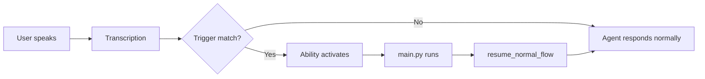

## Overview

**Trigger words** are spoken phrases that activate your Ability. When a user says a trigger phrase during a conversation, the Agent routes control to your Ability's `main.py`.

<Info>
Trigger words are configured in the **OpenHome Dashboard** when you install an Ability, not in your code.
</Info>

## How Trigger Words Work

When a user speaks during a conversation:

1. **Speech is transcribed** — The voice input is converted to text
2. **Trigger matching** — The system checks if the text contains any registered trigger phrases
3. **Ability activation** — If a match is found, your Ability takes control
4. **Conversation handoff** — Your `main.py` runs and handles the interaction
5. **Return control** — After `resume_normal_flow()`, the Agent resumes normal conversation



## Configuring Trigger Words

Trigger words are set in the **OpenHome Dashboard**, not in your code:

1. Go to [app.openhome.com](https://app.openhome.com)
2. Navigate to **Abilities** → Your Ability
3. Click **Settings** or **Trigger Words**
4. Add one or more trigger phrases
5. Save and test in the Live Editor

<Note>
**Important**: Trigger words are configuration, not code. Users can customize them when installing your Ability, so design your Ability to work with various activation phrases.
</Note>

## Best Practices for Trigger Words

### Make Them Natural

Choose phrases users would naturally say in conversation:

<CardGroup cols={2}>
  <Card title="Good Examples" icon="check">
    - "play something on audius"
    - "what's the weather"
    - "start a quiz"
    - "give me advice"
  </Card>
  <Card title="Bad Examples" icon="xmark">
    - "activate audius module"
    - "weather query execute"
    - "quiz start command"
    - "advice function run"
  </Card>
</CardGroup>

### Use Multiple Variations

Provide several ways to say the same thing:

```yaml
Weather Ability Triggers:
- "what's the weather"
- "check the weather"
- "how's the weather"
- "weather forecast"
- "tell me the weather"
```

This improves the user experience by catching different phrasings.

### Be Specific Enough

Avoid overly generic triggers that might conflict with normal conversation:

| Too Generic ❌ | Better ✅ |
|---------------|----------|
| "help" | "give me advice" |
| "play" | "play music" or "play a song" |
| "search" | "search the web" or "look this up" |
| "start" | "start a quiz" or "begin timer" |

### Consider Context

Think about when users would want your Ability:

**Music Player**
- "play music"
- "play a song"
- "play something"

**Quiz Game**
- "start a quiz"
- "quiz me"
- "let's play trivia"

**Weather**
- "what's the weather"
- "check the weather in [city]"
- "will it rain today"

### Avoid Ambiguity

Make sure your triggers don't overlap with other common Abilities:

| Ambiguous ⚠️ | Clear ✅ |
|-------------|----------|
| "search" | "search the web" (Perplexity) vs "search for music" (Audius) |
| "play" | "play music" vs "play a game" |
| "set" | "set an alarm" vs "set a timer" |

## Examples from Official Abilities

Here are real trigger word examples from OpenHome's official Abilities:

### Audius Music DJ
```yaml
- "play something on audius"
- "dj mode"
- "play music on audius"
```

### Basic Advisor
```yaml
- "give me advice"
- "help me"
- "i need advice"
```

### Date and Time
```yaml
- "what time is it"
- "what's today's date"
- "what day is it"
- "tell me the time"
```

### Perplexity Web Search
```yaml
- "search the web"
- "look this up"
- "search for"
```

### Quiz Game
```yaml
- "start a quiz"
- "quiz me"
- "let's play trivia"
```

### Weather
```yaml
- "what's the weather"
- "check the weather"
- "weather forecast"
```

<Info>
Notice how each ability uses 2-4 variations of the same intent, covering different ways users might phrase their request.
</Info>

## Brain Routing vs Direct Triggers

OpenHome uses two methods to activate Abilities:

### 1. Direct Trigger Match (Exact)

The system looks for exact phrase matches in the transcription. Fast and deterministic.

```
User: "play music on audius"
System: ✓ Exact match → Audius Music DJ activates
```

### 2. Brain Routing (LLM-based)

If no exact match is found, the Agent's LLM analyzes the intent and routes to the most appropriate Ability.

```
User: "I want to listen to some tunes"
Agent LLM: Intent = music playback → Routes to Music Player
```

<Note>
You don't control brain routing directly — it's automatic based on your Ability's name and description. Focus on providing good trigger words for the direct match path.
</Note>

## Testing Your Trigger Words

After setting trigger words, test them in the **Live Editor**:

1. Click **Live Editor** on your Ability
2. Click **Start Live Test**
3. Say your trigger phrases
4. Check the logs to see if your Ability activates
5. Try variations and edge cases
6. Adjust triggers based on what works

### Common Issues

| Problem | Solution |
|---------|----------|
| **Ability never activates** | Check transcription accuracy — your trigger might not match what the STT produces |
| **Activates too often** | Your trigger is too generic — make it more specific |
| **Only works with exact phrase** | Add more variations to catch different phrasings |
| **Conflicts with other Abilities** | Choose more distinctive trigger words |

## Trigger Words and User Experience

Well-designed trigger words create a seamless voice experience:

### Good Voice UX
```
User: "play something on audius"
Ability: "Great! What genre do you want to hear?"
User: "electronic"
Ability: "Playing electronic music from Audius."
```

### Poor Voice UX
```
User: "audius"
Ability: "Error: no input detected"
User: "what?"
Ability: "Please try again"
User: "activate audius music player"
Ability: "Great! What genre do you want to hear?"
```

<Info>
**Design Principle**: Users should be able to activate your Ability naturally, as if talking to a human.
</Info>

## Documenting Your Triggers

When sharing your Ability, document the trigger words in your README:

```markdown README.md
## Trigger Words

Activate this Ability by saying:

- "play something on audius"
- "dj mode"
- "play music on audius"

Note: Trigger words can be customized in the OpenHome Dashboard.
```

This helps users know how to activate your Ability and reminds them they can customize triggers.

## Advanced: Dynamic Triggers

Some Abilities work better with **parameterized triggers** where part of the phrase is dynamic:

```
"what's the weather in [city]"
"set an alarm for [time]"
"search for [query]"
```

Your Ability receives the full transcription, so you can parse parameters from the user's speech:

```python
user_input = await self.capability_worker.wait_for_complete_transcription()
# user_input = "what's the weather in Austin"

# Extract city with LLM
city = self.capability_worker.text_to_text_response(
    f"Extract just the city name from: {user_input}",
    system_prompt="Return only the city name, nothing else."
)
# city = "Austin"
```

## Summary

<CardGroup cols={2}>
  <Card title="Natural Language" icon="comments">
    Use phrases users would naturally say
  </Card>
  <Card title="Multiple Variations" icon="list">
    Provide 2-4 ways to say the same thing
  </Card>
  <Card title="Specific Enough" icon="bullseye">
    Avoid overly generic phrases
  </Card>
  <Card title="Configured in Dashboard" icon="gear">
    Set triggers in OpenHome Dashboard, not code
  </Card>
</CardGroup>

---

## Next Steps

<CardGroup cols={2}>
  <Card title="What Are Abilities?" icon="circle-question" href="/concepts/what-are-abilities">
    Learn the fundamentals of OpenHome Abilities
  </Card>
  <Card title="Ability Types" icon="shapes" href="/concepts/ability-types">
    Understand Skills, Daemons, and Local abilities
  </Card>
  <Card title="Build Your First Ability" icon="rocket" href="/quickstart">
    Follow the 5-minute quickstart guide
  </Card>
  <Card title="Contributing Guide" icon="upload" href="/contributing/overview">
    Ship your Ability to the Marketplace
  </Card>
</CardGroup>