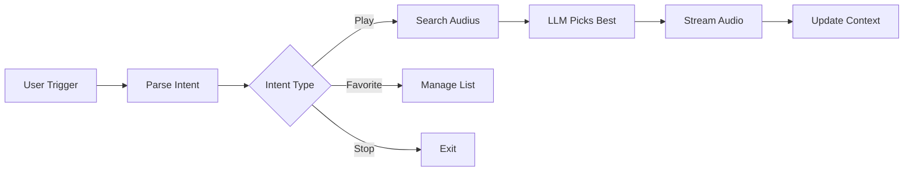

## What It Does

A fully voice-controlled music player powered by the free Audius decentralized music platform. Ask for songs by name, artist, genre, mood, or vibe — it finds the best match, streams it live, and lets you manage a favorites list. No API key required.

## Suggested Trigger Words

- "play music"
- "play a song"
- "play something"
- "music"

## Key Features

<CardGroup cols={2}>
  <Card title="Smart Search" icon="magnifying-glass">
    Supports song name, artist, genre, mood, time era, and contextual vibes
  </Card>
  <Card title="Session Mode" icon="layer-group">
    Establishes a broader theme across multiple songs for continuous playback
  </Card>
  <Card title="Favorites System" icon="heart">
    Add, remove, and play back your saved songs with voice commands
  </Card>
  <Card title="No Repeat Logic" icon="ban">
    Tracks recently played songs and intelligently avoids replaying them
  </Card>
</CardGroup>

## How It Works

### Architecture Flow



<Steps>
  <Step title="User Activation">
    User triggers with "play music" or similar hotword
  </Step>
  <Step title="Intent Analysis">
    LLM analyzes the request and extracts structured details (song, artist, genre, mood, context)
  </Step>
  <Step title="Smart Search">
    Queries Audius API with filters. Falls back to GPT suggestions if no results found
  </Step>
  <Step title="Track Selection">
    LLM picks the best matching track from search results, avoiding recently played songs
  </Step>
  <Step title="Audio Streaming">
    Streams audio directly from Audius with pause/resume support
  </Step>
  <Step title="Session Management">
    Maintains context for "play something similar" requests and session continuity
  </Step>
</Steps>

## API Requirements

<Note>
  **No API key required!** Audius is a free, open music platform.
</Note>

The ability automatically connects to the best available Audius host on startup.

## Code Walkthrough

### Host Discovery

The ability dynamically discovers the best Audius API host:

```python
def _get_host(self):
    """Get the best available host from Audius"""
    try:
        response = requests.get(AUDIUS_API)
        if response.status_code == 200:
            return response.json().get('data')[0]
        return None
    except Exception as e:
        self.worker.editor_logging_handler.error(f"Error getting host: {str(e)}")
        return None
```

### Intent Classification

The ability uses structured LLM prompts to parse user requests:

```python
async def check_song_request(self, message: str) -> dict:
    """Check if the message contains a song request"""
    check_prompt = f"""
    You are a DJ assistant.  
    Your job is to analyze the user's request and return a JSON object...
    
    ### INTENTS (choose only one):
    - "direct_play"
    - "stop"
    - "pause"
    - "resume"
    - "add_to_favorites"
    - "remove_from_favorites"
    - "play_favorites"
    - "conversation"
    """
    
    response = self.capability_worker.text_to_text_response(check_prompt, [])
    return json.loads(response)
```

<Accordion title="Full Intent Schema">
```json
{
  "intent": "<intent>",
  "details": {
    "genre": null,
    "artist": null,
    "song": null,
    "mood": null,
    "context": null,
    "time_era": null,
    "extra": null
  },
  "summary": "",
  "needs_more_info": false,
  "use_context": false,
  "session": false
}
```
</Accordion>

### Genre and Mood Normalization

The ability handles aliases and case-insensitive matching:

```python
# Full official genres (Audius is case-sensitive!)
AUDIUS_GENRES = {
    "alternative": "Alternative",
    "hip-hop/rap": "Hip-Hop/Rap",
    "r&b/soul": "R&B/Soul",
    # ... more genres
}

# Aliases for genres → canonical keys
GENRE_ALIASES = {
    "hip hop": "hip-hop/rap",
    "hiphop": "hip-hop/rap",
    "rap": "hip-hop/rap",
    "rnb": "r&b/soul",
    "r&b": "r&b/soul",
    # ... more aliases
}

def normalize_genre(self, raw: str | None) -> str | None:
    """Normalize genre string to Audius format"""
    if not raw:
        return None
    key = raw.strip().lower()
    if key in GENRE_ALIASES:
        key = GENRE_ALIASES[key]
    return AUDIUS_GENRES.get(key)
```

### Audio Streaming

Streams audio with pause/resume support:

```python
async def stream_audio_simple_2(self, stream_response):
    """Stream audio chunks directly as they arrive from the server"""
    try:
        await self.capability_worker.stream_init()

        # Stream incoming audio chunks
        async for chunk in stream_response.aiter_bytes(chunk_size=25*1024):
            if not chunk:
                continue

            # Stop check
            if self.worker.music_mode_stop_event.is_set():
                await self.capability_worker.stream_end()
                return

            # Pause check
            while self.worker.music_mode_pause_event.is_set():
                await asyncio.sleep(0.1)

            # Send the chunk
            await self.capability_worker.send_audio_data_in_stream(chunk)

        await self.capability_worker.stream_end()
    except Exception as e:
        self.worker.editor_logging_handler.error(f"Error streaming: {str(e)}")
```

### Favorites Management

Persistent favorites storage with add/remove operations:

```python
elif intent == "add_to_favorites":
    gc = self.capability_worker.get_single_key("global_context").get("value", {})
    song_id = gc.get("last_song_id")
    song_message = gc.get("last_played_message")

    if song_id:
        favorites = self.capability_worker.get_single_key("favorites").get("value", [])
        
        if not any(fav["song_id"] == song_id for fav in favorites):
            favorites.append({"song_id": song_id, "song_message": song_message})
            self.capability_worker.update_key("favorites", favorites)
            await self.capability_worker.speak("Song added to your favorites.")
        else:
            await self.capability_worker.speak("This song is already in your favorites.")
```

## Supported Genres

Alternative, Ambient, Acoustic, Blues, Classical, Country, Electronic, Folk, Funk, Hip-Hop/Rap, Indie, Jazz, Latin, Lo-Fi, Metal, Pop, Punk, R&B/Soul, Reggae, Rock, Soundtrack, World, and more.

## Supported Moods

Aggressive, Calm, Cool, Easygoing, Empowering, Energizing, Melancholy, Peaceful, Romantic, Rowdy, Sensual, Upbeat, Yearning, and more.

## Example Conversation Flow

<CodeGroup>
```text Simple Request
User: play music
AI: (listens for request)

User: play something chill by Frank Ocean
AI: I am searching a song for you, please wait!
     Now playing Thinking Bout You by Frank Ocean.
     (song streams)
     What would you like me to do next?
```

```text Favorites Flow
User: add to favorites
AI: Song added to your favorites.

User: play something similar
AI: I am searching a song for you, please wait!
     Now playing Ivy by Frank Ocean.

User: play my favorites
AI: Playing your favorite songs.
     Now playing Thinking Bout You by Frank Ocean...
```

```text Genre Request
User: play electronic music
AI: I am searching a song for you, please wait!
     Now playing Strobe by deadmau5.

User: stop
AI: Music off! Hope you enjoyed the vibes — catch you later!
```
</CodeGroup>

<Tip>
  Say "play something similar" to continue with music that matches your current mood!
</Tip>
